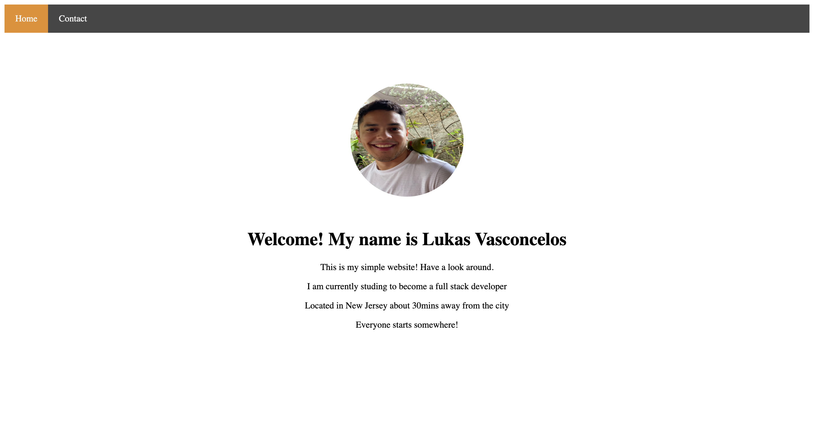

# Simple HTML/CSS Personal Website

# Overview
- Simple personal website built using purely HTML and CSS.
- Website contains a home page with a profile picture as well as a contact page with contact information.

# Website
- Here's a link to the website hosted via Github Pages! https://github.com/iitsluke/HTML-CSS-web

# Preview

# Summary
This project was created using only HTML & CSS. While working on this project, I was able to learn new techniques on how to add images to pages with "img" tags. I also learned how to add CSS style to a page and have it all link together with a named class attribute. While working on this project the hardest part was to know how to style each block separately & understanding how to use unordered list with anchor tags. Feels very satisfing to know I was able to apply the skills acquired to complete this assignment and have everything running smooth. 
# Author 
Lukas Vasconcelos | <em> Full Stack Software Developer </em> | <a href="https://github.com/iitsluke">Github</a>
